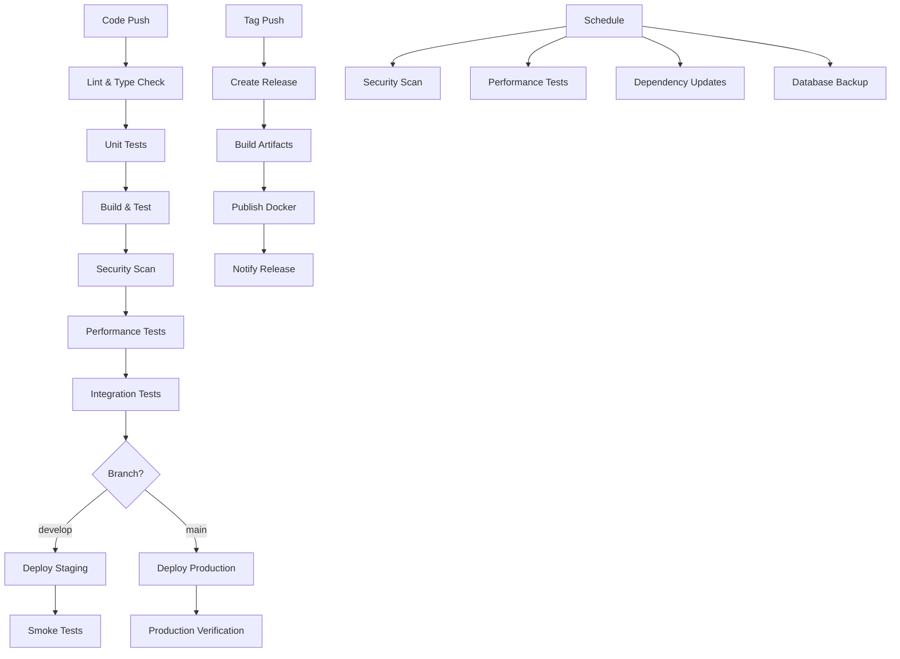

# CI/CD Documentation

## 🚀 Overview

This document describes the complete CI/CD pipeline for the SkillPort Community project, including automated testing, building, deployment, and monitoring.

## 📋 Pipeline Workflows

### 1. **Main CI Pipeline** (`.github/workflows/ci.yml`)

**Triggers:**
- Push to `main` or `develop` branches
- Pull requests to `main` or `develop` branches

**Jobs:**
- **Lint & Type Check**: ESLint, TypeScript, security audit
- **Unit Tests**: Jest tests with PostgreSQL service
- **Build & Test Production**: Production build verification
- **Security Scan**: Trivy vulnerability scanner
- **Performance Tests**: Lighthouse CI, load testing
- **Database Migration Test**: Prisma migration testing
- **Integration Tests**: End-to-end API testing
- **Deploy to Staging**: Automatic deployment to staging on `develop`
- **Deploy to Production**: Automatic deployment to production on `main`

### 2. **Docker Pipeline** (`.github/workflows/docker.yml`)

**Triggers:**
- Push to `main` or `develop` branches
- Push tags (releases)
- Pull requests to `main`

**Jobs:**
- **Build Docker Image**: Multi-platform build (AMD64, ARM64)
- **Security Scan**: Docker image vulnerability scanning
- **Deploy to Staging**: Container deployment to staging
- **Deploy to Production**: Container deployment to production

### 3. **Release Pipeline** (`.github/workflows/release.yml`)

**Triggers:**
- Push tags starting with `v*`

**Jobs:**
- **Create GitHub Release**: Automated release creation
- **Build Release Artifacts**: Production build archives
- **Publish to Docker Hub**: Container registry publishing
- **Notify Release**: Slack/Discord notifications

### 4. **Security Pipeline** (`.github/workflows/security.yml`)

**Triggers:**
- Push to `main` or `develop` branches
- Pull requests to `main` or `develop` branches
- Weekly schedule (Monday 2 AM)

**Jobs:**
- **Dependency Vulnerability Scan**: npm audit, Snyk
- **Code Security Scan**: CodeQL analysis
- **Docker Image Security Scan**: Trivy container scanning
- **Secrets Scan**: TruffleHog secrets detection
- **License Compliance Scan**: License compatibility check
- **Security Headers Test**: HTTP security headers verification
- **OWASP ZAP Security Scan**: Web application security testing

### 5. **Performance Pipeline** (`.github/workflows/performance.yml`)

**Triggers:**
- Push to `main` or `develop` branches
- Pull requests to `main` or `develop` branches
- Weekly schedule (Tuesday 3 AM)

**Jobs:**
- **Lighthouse Performance Tests**: Web performance metrics
- **Load Testing**: Artillery load testing
- **Database Performance Tests**: Database query performance
- **Memory Usage Monitoring**: Application memory tracking
- **Bundle Size Analysis**: JavaScript/CSS bundle analysis
- **Performance Regression Detection**: PR performance comparison

### 6. **Dependency Update Pipeline** (`.github/workflows/dependency-update.yml`)

**Triggers:**
- Weekly schedule (Monday 4 AM)
- Manual workflow dispatch

**Jobs:**
- **Check for Updates**: Outdated package detection
- **Create Update PR**: Automated dependency updates
- **Notify Updates**: Slack notifications
- **Security Alerts**: High/critical vulnerability alerts
- **License Compliance Check**: License compatibility verification

### 7. **Backup Pipeline** (`.github/workflows/backup.yml`)

**Triggers:**
- Daily schedule (2 AM)
- Manual workflow dispatch

**Jobs:**
- **Database Backup**: PostgreSQL database backup
- **Application Data Backup**: Application files backup
- **Configuration Backup**: Configuration files backup
- **Verify Backup Integrity**: Backup verification
- **Notify Backup Status**: Backup completion notifications
- **Cleanup Old Backups**: Old backup cleanup
- **Monitor Backup Health**: Backup health monitoring

## 🐳 Docker Configuration

### **Dockerfile**
- Multi-stage build for optimization
- Node.js 18 Alpine base image
- Prisma client generation
- Next.js standalone output
- Security best practices

### **docker-compose.yml**
- PostgreSQL database service
- Redis cache service
- SkillPort application service
- Nginx reverse proxy
- Database migration service
- Health checks and dependencies

### **nginx.conf**
- Reverse proxy configuration
- SSL/TLS termination
- Security headers
- Rate limiting
- Gzip compression
- Static file caching

## 🔧 Environment Variables

### **Required Secrets**
```bash
# Database
DATABASE_URL
STAGING_DATABASE_URL
PRODUCTION_DATABASE_URL

# Authentication
JWT_SECRET
NEXTAUTH_SECRET
NEXTAUTH_URL

# External Services
RAZORPAY_KEY_ID
RAZORPAY_KEY_SECRET
EMAIL_HOST
EMAIL_USER
EMAIL_PASS
SENTRY_DSN
SENTRY_ORG
SENTRY_PROJECT

# Deployment
VERCEL_TOKEN
VERCEL_ORG_ID
VERCEL_PROJECT_ID
DOCKERHUB_USERNAME
DOCKERHUB_TOKEN

# Notifications
SLACK_WEBHOOK_URL
DISCORD_WEBHOOK
```

### **Optional Secrets**
```bash
# Cloud Storage
AWS_ACCESS_KEY_ID
AWS_SECRET_ACCESS_KEY
S3_BUCKET_NAME
GOOGLE_CLOUD_KEY
GCS_BUCKET_NAME

# Monitoring
LHCI_GITHUB_APP_TOKEN
SNYK_TOKEN
```

## 🚀 Deployment Strategies

### **Staging Deployment**
- Automatic on `develop` branch push
- Vercel staging environment
- Database: Staging PostgreSQL
- Testing: Full test suite execution

### **Production Deployment**
- Automatic on `main` branch push
- Vercel production environment
- Database: Production PostgreSQL
- Verification: Smoke tests and health checks

### **Container Deployment**
- Docker Hub image publishing
- Multi-platform support (AMD64, ARM64)
- Security scanning with Trivy
- Automated container updates

## 📊 Monitoring & Alerting

### **Performance Monitoring**
- Lighthouse CI scores
- Bundle size tracking
- Memory usage monitoring
- Database performance metrics
- API response time tracking

### **Security Monitoring**
- Dependency vulnerability scanning
- Code security analysis
- Docker image security scanning
- Secrets detection
- License compliance monitoring

### **Backup Monitoring**
- Daily backup verification
- Backup integrity checks
- Storage size monitoring
- Backup frequency tracking

### **Notifications**
- **Slack**: Deployment status, security alerts, backup reports
- **Discord**: Release notifications
- **GitHub**: PR comments, issue creation
- **Email**: Critical security alerts

## 🔄 Workflow Dependencies



## 🛠️ Local Development

### **Prerequisites**
```bash
# Node.js 18.17+
node --version

# PostgreSQL 13+
psql --version

# Docker (optional)
docker --version
docker-compose --version
```

### **Setup Commands**
```bash
# Install dependencies
npm ci

# Generate Prisma client
npm run db:generate

# Setup database
npm run db:push
npm run db:seed
npm run db:seed:admin

# Start development
npm run dev
```

### **Docker Development**
```bash
# Start all services
docker-compose up -d

# Run migrations
docker-compose exec app npm run db:push

# Seed database
docker-compose exec app npm run db:seed

# View logs
docker-compose logs -f app
```

## 📈 Performance Targets

### **Lighthouse Scores**
- **Performance**: > 90
- **Accessibility**: > 95
- **Best Practices**: > 95
- **SEO**: > 90

### **API Response Times**
- **Health Check**: < 100ms
- **Dashboard**: < 500ms
- **Contests**: < 300ms
- **Authentication**: < 200ms

### **Bundle Size Limits**
- **JavaScript**: < 500KB (gzipped)
- **CSS**: < 100KB (gzipped)
- **Total**: < 1MB (gzipped)

## 🔒 Security Requirements

### **Dependency Security**
- No high/critical vulnerabilities
- Regular dependency updates
- License compliance verification

### **Code Security**
- No secrets in code
- Secure coding practices
- Input validation and sanitization

### **Infrastructure Security**
- Security headers enabled
- Rate limiting configured
- SSL/TLS encryption
- Container security scanning

## 📋 Troubleshooting

### **Common Issues**

#### **Build Failures**
```bash
# Clear cache and reinstall
rm -rf node_modules package-lock.json
npm install

# Check Node.js version
node --version  # Should be 18.17+
```

#### **Database Issues**
```bash
# Reset database
npm run db:push --force-reset
npm run db:seed

# Check connection
npx prisma db pull
```

#### **Docker Issues**
```bash
# Rebuild containers
docker-compose down
docker-compose build --no-cache
docker-compose up -d

# Check logs
docker-compose logs app
```

#### **Deployment Issues**
```bash
# Check environment variables
vercel env ls

# Redeploy
vercel --prod

# Check logs
vercel logs
```

### **Performance Issues**
- Check bundle size with `npm run build`
- Analyze Lighthouse reports
- Monitor memory usage
- Review database queries

### **Security Issues**
- Run `npm audit` locally
- Check for secrets with `trufflehog`
- Verify security headers
- Review dependency licenses

## 📚 Additional Resources

- [GitHub Actions Documentation](https://docs.github.com/en/actions)
- [Docker Documentation](https://docs.docker.com/)
- [Next.js Deployment](https://nextjs.org/docs/deployment)
- [Prisma Documentation](https://www.prisma.io/docs/)
- [Vercel Documentation](https://vercel.com/docs)

## 🎯 Best Practices

1. **Always test locally** before pushing
2. **Use feature branches** for new development
3. **Review all changes** before merging
4. **Monitor deployment status** after pushes
5. **Keep dependencies updated** regularly
6. **Monitor security alerts** and act quickly
7. **Verify backups** are working correctly
8. **Test performance** on staging before production

---

**Last Updated**: December 2024  
**Version**: 2.0.0  
**Status**: Production Ready ✅
