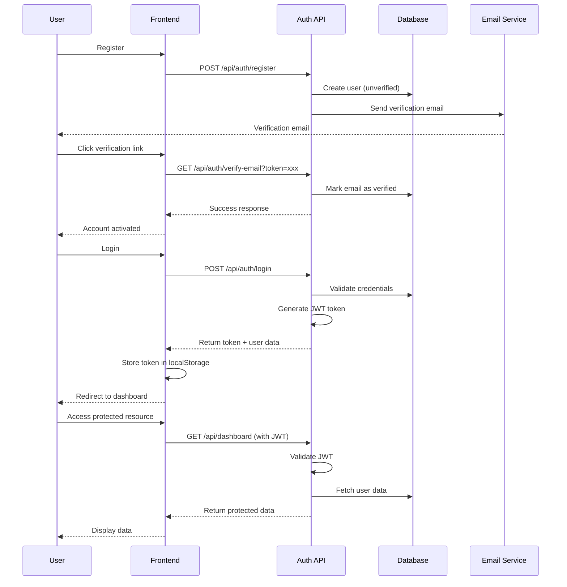
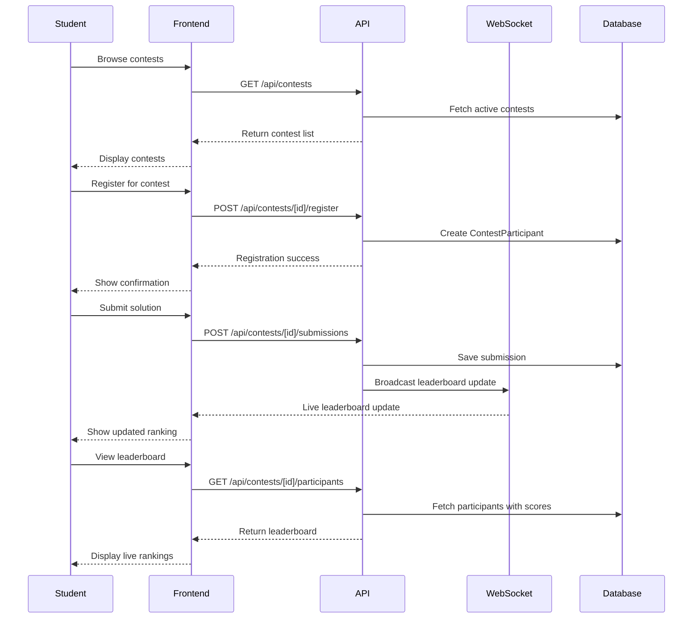

# ROLE_FLOWS.md

## Executive Summary

The SkillPort Community platform is a multi-role learning management system supporting four distinct user types (Admin, Mentor, Student, Personal) with comprehensive authentication, real-time features, payment integration, and browser extension data sync. This document provides complete role flows, API endpoints, acceptance criteria, and QA test cases for production deployment.

---

## 🔐 Authentication & Authorization

### Overview
JWT-based authentication with role-based access control, email verification, password reset, and secure session management.

### Authentication Flow
1. **Registration** → Email verification → Account activation
2. **Login** → JWT token generation → Role-based access
3. **Token Refresh** → Automatic token renewal → Continued access
4. **Logout** → Token invalidation → Session cleanup

### JWT Usage
```javascript
// Required headers for authenticated requests
Authorization: Bearer <jwt_token>
Content-Type: application/json
```

### API Endpoints

| Method | Path | Purpose | Auth Required |
|--------|------|---------|---------------|
| POST | `/api/auth/register` | User registration | No |
| POST | `/api/auth/login` | User login | No |
| GET | `/api/auth/verify-email` | Email verification | No |
| POST | `/api/auth/forgot-password` | Password reset request | No |
| POST | `/api/auth/reset-password` | Password reset | No |

### Mermaid Sequence Diagram



### Data Models Involved
- **User**: id, email, password, role, emailVerified, emailVerificationToken
- **ActivityLog**: userId, action, details, createdAt

### Acceptance Criteria
- ✅ User can register with valid email/password
- ✅ Verification email sent immediately after registration
- ✅ Account remains inactive until email verified
- ✅ Login fails for unverified accounts
- ✅ JWT token expires after configured time
- ✅ Refresh token automatically renews access
- ✅ Logout invalidates all tokens

### Manual Test Cases
1. Register with valid email → Check verification email sent
2. Register with invalid email → Check validation error
3. Login before email verification → Check error message
4. Verify email → Check account activation
5. Login after verification → Check successful authentication
6. Access protected route without token → Check redirect to login
7. Access protected route with expired token → Check token refresh
8. Logout → Check token invalidation

---

## 👨‍💼 Admin Role

### Overview
System administrators with full platform control, user management, and analytics access.

### UI Pages & Components
- **Pages**: Dashboard, User Management, Mentor Management, Contest Management, Analytics, Leaderboard, Profile
- **Components**: AdminHeader, AdminLayout, AdminCard, AdminTable, AdminModal, AdminButton, AdminInput, AdminToast

### Key Actions & Flows

#### 1. User Management Flow
1. Navigate to Users page
2. View user list with pagination
3. Filter/search users by role/status
4. Edit user details (role, status, profile)
5. Delete user (with confirmation)
6. View user activity logs

#### 2. Contest Management Flow
1. Navigate to Contests page
2. Create new contest (title, description, dates, problems)
3. Edit existing contest details
4. Manage contest participants
5. View contest submissions
6. Export contest data

#### 3. Analytics Dashboard Flow
1. Navigate to Analytics page
2. View system-wide statistics
3. Filter data by date range
4. Export analytics reports
5. Monitor platform performance

### Relevant API Endpoints

| Method | Path | Purpose | Auth Required |
|--------|------|---------|---------------|
| GET | `/api/admin/dashboard` | Admin dashboard stats | Admin |
| GET | `/api/admin/users` | List all users | Admin |
| GET | `/api/admin/users/[id]` | Get user details | Admin |
| PUT | `/api/admin/users/[id]` | Update user | Admin |
| DELETE | `/api/admin/users/[id]` | Delete user | Admin |
| GET | `/api/admin/contests` | List all contests | Admin |
| POST | `/api/admin/contests` | Create contest | Admin |
| PUT | `/api/admin/contests/[id]` | Update contest | Admin |
| GET | `/api/admin/analytics` | System analytics | Admin |
| GET | `/api/admin/leaderboard` | Global leaderboard | Admin |

### Data Models Involved
- **User**: All fields + role-based filtering
- **Contest**: id, title, description, startDate, endDate, status
- **ContestParticipant**: userId, contestId, score, rank, status
- **ActivityLog**: userId, action, details, createdAt
- **Feedback**: All feedback records across platform

### Acceptance Criteria
- ✅ Admin can view all users with pagination
- ✅ Admin can filter users by role and status
- ✅ Admin can edit user roles and profiles
- ✅ Admin can create and manage contests
- ✅ Admin can view system analytics
- ✅ Admin can export data in multiple formats
- ✅ Non-admin users cannot access admin endpoints

### Edge Cases & Error States
- **Large datasets**: Pagination works correctly
- **Concurrent edits**: Last-write-wins with conflict detection
- **Invalid user data**: Validation errors displayed
- **Network failures**: Retry mechanisms and error messages

### Manual Test Cases
1. Login as admin → Check admin dashboard loads
2. Navigate to users → Check user list displays
3. Filter users by role → Check filtered results
4. Edit user role → Check role update persists
5. Create new contest → Check contest appears in list
6. Access non-admin page → Check access denied
7. Export analytics → Check file download works
8. Delete user → Check confirmation dialog

---

## 👨‍🏫 Mentor Role

### Overview
Educators who manage contests, provide feedback, and monitor student progress.

### UI Pages & Components
- **Pages**: Dashboard, Contests, Contest Management, Feedback, Leaderboard, Profile
- **Components**: MentorHeader, MentorLayout, MentorCard, MentorTable, MentorModal, MentorButton, MentorInput, MentorToast

### Key Actions & Flows

#### 1. Contest Management Flow
1. Navigate to Contests page
2. View assigned contests
3. Create new contest
4. Manage contest problems
5. Monitor participant progress
6. View live leaderboard

#### 2. Feedback System Flow
1. Navigate to Feedback page
2. View pending feedback requests
3. Select student and contest
4. Provide detailed feedback
5. Rate student performance
6. Submit feedback

#### 3. Student Monitoring Flow
1. View student leaderboard
2. Filter by contest or date range
3. Export leaderboard data
4. View individual student progress
5. Send notifications to students

### Relevant API Endpoints

| Method | Path | Purpose | Auth Required |
|--------|------|---------|---------------|
| GET | `/api/mentor/dashboard` | Mentor dashboard | Mentor |
| GET | `/api/mentor/contests` | Mentor contests | Mentor |
| POST | `/api/mentor/contests` | Create contest | Mentor |
| GET | `/api/mentor/feedback` | Pending feedback | Mentor |
| POST | `/api/mentor/feedback` | Submit feedback | Mentor |
| GET | `/api/mentor/leaderboard` | Student leaderboard | Mentor |
| GET | `/api/mentor/leaderboard/export` | Export leaderboard | Mentor |

### Data Models Involved
- **Contest**: id, title, description, mentorId, startDate, endDate
- **Feedback**: id, mentorId, studentId, contestId, rating, comment, category
- **ContestParticipant**: userId, contestId, score, rank, status
- **User**: id, name, email, role (for student details)

### Acceptance Criteria
- ✅ Mentor can view assigned contests
- ✅ Mentor can create new contests
- ✅ Mentor can provide feedback to students
- ✅ Mentor can view student leaderboards
- ✅ Mentor can export contest data
- ✅ Feedback appears in student dashboard
- ✅ Real-time updates for contest progress

### Edge Cases & Error States
- **No contests assigned**: Empty state with create button
- **Feedback deadline passed**: Clear error message
- **Invalid feedback data**: Validation errors
- **Network issues**: Retry mechanisms

### Manual Test Cases
1. Login as mentor → Check mentor dashboard
2. Create new contest → Check contest appears
3. Add problems to contest → Check problems saved
4. Provide feedback → Check feedback submitted
5. View leaderboard → Check real-time updates
6. Export data → Check file download
7. Access admin features → Check access denied

---

## 🎓 Student Role

### Overview
Learners who participate in contests, receive feedback, and track their progress.

### UI Pages & Components
- **Pages**: Dashboard, Contests, Contest Participation, Feedback, Leaderboard, Profile
- **Components**: StudentHeader, StudentLayout, EnhancedDashboard, EnhancedTracker

### Key Actions & Flows

#### 1. Contest Participation Flow
1. Browse available contests
2. View contest details and rules
3. Register for contest
4. View contest problems
5. Submit solutions
6. View live leaderboard
7. Check contest results

#### 2. Feedback System Flow
1. Navigate to Feedback page
2. View received feedback
3. Request new feedback from mentor
4. Filter feedback by type/mentor
5. View detailed feedback comments
6. Rate feedback helpfulness

#### 3. Progress Tracking Flow
1. View personal dashboard
2. Check learning statistics
3. View extension data sync
4. Monitor contest performance
5. Track skill development

### Relevant API Endpoints

| Method | Path | Purpose | Auth Required |
|--------|------|---------|---------------|
| GET | `/api/dashboard` | Student dashboard | Student |
| GET | `/api/contests` | Available contests | Student |
| POST | `/api/contests/[id]/register` | Register for contest | Student |
| GET | `/api/contests/[id]` | Contest details | Student |
| GET | `/api/contests/[id]/submissions` | My submissions | Student |
| GET | `/api/feedbacks` | My feedback | Student |
| POST | `/api/feedbacks/request` | Request feedback | Student |
| GET | `/api/extension/data` | Extension data | Student |

### Data Models Involved
- **Contest**: id, title, description, startDate, endDate, status
- **ContestParticipant**: userId, contestId, score, rank, status
- **Submission**: id, userId, contestId, problemId, code, status, score
- **Feedback**: id, mentorId, studentId, rating, comment, category
- **ExtensionData**: platform, submissions, lastSync, statistics

### Acceptance Criteria
- ✅ Student can view available contests
- ✅ Student can register for contests
- ✅ Student can submit solutions
- ✅ Student can view live leaderboard
- ✅ Student can request and view feedback
- ✅ Extension data syncs automatically
- ✅ Real-time updates for contest progress

### Edge Cases & Error States
- **Contest registration closed**: Clear error message
- **Invalid submission**: Validation errors
- **Network timeout**: Retry mechanisms
- **Extension not installed**: Helpful guidance

### Manual Test Cases
1. Login as student → Check dashboard loads
2. Browse contests → Check contest list
3. Register for contest → Check registration success
4. Submit solution → Check submission recorded
5. View leaderboard → Check real-time updates
6. Request feedback → Check request sent
7. View extension data → Check sync status
8. Access mentor features → Check access denied

---

## 👤 Personal Role

### Overview
General users with learning tracking, community features, and subscription management.

### UI Pages & Components
- **Pages**: Dashboard, Stats, Communities, Tracker, Projects, Profile, Privacy, Subscription
- **Components**: PersonalHeader, PersonalLayout, EnhancedTracker, DataExportModal, AccountDeletionModal

### Key Actions & Flows

#### 1. Learning Tracker Flow
1. Navigate to Tracker page
2. View extension data sync status
3. Monitor coding progress
4. View platform statistics
5. Check submission history
6. Analyze performance trends

#### 2. Privacy Management Flow
1. Navigate to Privacy page
2. Manage cookie preferences
3. Update consent settings
4. Export personal data
5. Request account deletion
6. View privacy policy

#### 3. Subscription Management Flow
1. Navigate to Subscription page
2. View current plan
3. Upgrade/downgrade plan
4. Manage payment methods
5. View billing history
6. Cancel subscription

### Relevant API Endpoints

| Method | Path | Purpose | Auth Required |
|--------|------|---------|---------------|
| GET | `/api/dashboard` | Personal dashboard | Personal |
| GET | `/api/extension/data` | Extension data | Personal |
| POST | `/api/extension/sync` | Sync extension data | Personal |
| GET | `/api/user/consent` | Consent status | Personal |
| POST | `/api/user/consent` | Update consent | Personal |
| GET | `/api/user/data-export` | Export data | Personal |
| POST | `/api/user/delete-account` | Delete account | Personal |
| GET | `/api/subscription` | Subscription status | Personal |
| POST | `/api/subscription/cancel` | Cancel subscription | Personal |

### Data Models Involved
- **User**: id, name, email, preferences, subscription
- **ExtensionData**: platform, submissions, statistics
- **ConsentRecord**: userId, consentType, granted, grantedAt
- **Subscription**: userId, planId, status, currentPeriodStart
- **Payment**: userId, amount, status, method, createdAt

### Acceptance Criteria
- ✅ User can view learning progress
- ✅ Extension data syncs automatically
- ✅ User can manage privacy preferences
- ✅ User can export personal data
- ✅ User can manage subscription
- ✅ Cookie consent works properly
- ✅ Account deletion has grace period

### Edge Cases & Error States
- **Extension not available**: Graceful fallback
- **Sync failures**: Retry mechanisms
- **Payment failures**: Clear error messages
- **Data export large**: Progress indicators

### Manual Test Cases
1. Login as personal user → Check dashboard
2. View tracker → Check extension data
3. Update privacy settings → Check persistence
4. Export data → Check download
5. Manage subscription → Check plan changes
6. Request account deletion → Check confirmation
7. Update cookie consent → Check behavior

---

## 🏆 Contests & Participation

### Overview
Contest system with real-time participation, problem solving, and live leaderboards.

### Contest Participation Flow
1. **Browse Contests** → View available contests with filters
2. **Contest Details** → Read rules, problems, and timeline
3. **Register** → Join contest with validation
4. **Problem Solving** → View problems and submit solutions
5. **Live Updates** → Real-time leaderboard and notifications
6. **Results** → View final rankings and feedback

### Mermaid Contest Flow Diagram



### API Endpoints

| Method | Path | Purpose | Auth Required |
|--------|------|---------|---------------|
| GET | `/api/contests` | List contests | Any |
| GET | `/api/contests/[id]` | Contest details | Any |
| POST | `/api/contests/[id]/register` | Register for contest | Student |
| GET | `/api/contests/[id]/participants` | Contest leaderboard | Any |
| GET | `/api/contests/[id]/submissions` | My submissions | Student |
| POST | `/api/contests/[id]/submissions` | Submit solution | Student |

### WebSocket Events
- `contest:update` - Contest status changes
- `leaderboard:update` - Leaderboard changes
- `submission:received` - New submission
- `notification:new` - Contest notifications

### Acceptance Criteria
- ✅ Students can browse and filter contests
- ✅ Registration validates contest availability
- ✅ Submissions are processed in real-time
- ✅ Leaderboard updates live during contest
- ✅ Contest rules and problems display correctly
- ✅ Results are calculated accurately

### Manual Test Cases
1. Browse contests → Check list loads
2. Register for contest → Check success
3. Submit solution → Check processing
4. View leaderboard → Check real-time updates
5. Check contest rules → Check display
6. Verify submission status → Check accuracy

---

## 💬 Feedback System

### Overview
Mentor-student feedback system with request management, rating, and tracking.

### Feedback Flow
1. **Request Feedback** → Student requests feedback from mentor
2. **Mentor Review** → Mentor views pending requests
3. **Provide Feedback** → Mentor submits detailed feedback
4. **Student Review** → Student views received feedback
5. **Feedback Management** → Filter, sort, and track feedback

### API Endpoints

| Method | Path | Purpose | Auth Required |
|--------|------|---------|---------------|
| GET | `/api/feedbacks` | List feedback | Student/Mentor |
| GET | `/api/feedbacks/[id]` | Get feedback details | Student/Mentor |
| POST | `/api/feedbacks/request` | Request feedback | Student |
| POST | `/api/mentor/feedback` | Submit feedback | Mentor |
| GET | `/api/mentor/feedback` | Pending feedback | Mentor |

### Data Models Involved
- **Feedback**: id, mentorId, studentId, contestId, rating, comment, category, createdAt
- **User**: id, name, email (for mentor/student details)

### Acceptance Criteria
- ✅ Students can request feedback
- ✅ Mentors can view pending requests
- ✅ Feedback submission validates required fields
- ✅ Students can view received feedback
- ✅ Feedback can be filtered and sorted
- ✅ Rating system works correctly

### Manual Test Cases
1. Request feedback → Check request sent
2. Mentor views requests → Check list displays
3. Submit feedback → Check validation
4. Student views feedback → Check display
5. Filter feedback → Check filtering works
6. Rate feedback → Check rating saved

---

## 🏅 Leaderboard

### Overview
Global and contest-specific leaderboards with real-time updates and export functionality.

### Leaderboard Flow
1. **View Leaderboard** → Display rankings with pagination
2. **Real-time Updates** → Live score updates via WebSocket
3. **Filter & Sort** → Filter by contest, date, or user
4. **Export Data** → Download leaderboard as CSV/JSON
5. **Podium View** → Special display for top performers

### API Endpoints

| Method | Path | Purpose | Auth Required |
|--------|------|---------|---------------|
| GET | `/api/leaderboard` | Global leaderboard | Any |
| GET | `/api/contests/[id]/participants` | Contest leaderboard | Any |
| GET | `/api/mentor/leaderboard` | Student leaderboard | Mentor |
| GET | `/api/mentor/leaderboard/export` | Export leaderboard | Mentor |

### Acceptance Criteria
- ✅ Leaderboard displays accurate rankings
- ✅ Real-time updates work correctly
- ✅ Pagination handles large datasets
- ✅ Export generates valid files
- ✅ Filtering and sorting work
- ✅ Podium view highlights top performers

### Manual Test Cases
1. View global leaderboard → Check rankings
2. Check real-time updates → Check live changes
3. Test pagination → Check page navigation
4. Export data → Check file download
5. Filter by contest → Check filtered results
6. Sort by score → Check sorting works

---

## 👤 Profile & Preferences

### Overview
User profile management with avatar upload, preferences, and security settings.

### Profile Management Flow
1. **View Profile** → Display current user information
2. **Edit Profile** → Update name, bio, and preferences
3. **Avatar Upload** → Upload and preview profile picture
4. **Change Password** → Update password with validation
5. **Preferences** → Manage notification and privacy settings

### API Endpoints

| Method | Path | Purpose | Auth Required |
|--------|------|---------|---------------|
| GET | `/api/profile` | Get profile | Any |
| PUT | `/api/profile` | Update profile | Any |
| POST | `/api/profile/avatar` | Upload avatar | Any |
| POST | `/api/profile/password` | Change password | Any |

### Acceptance Criteria
- ✅ Profile displays current information
- ✅ Avatar upload works with preview
- ✅ Password change validates old password
- ✅ Preferences save correctly
- ✅ Validation errors display properly
- ✅ Toast notifications show success/error

### Manual Test Cases
1. View profile → Check information displays
2. Edit profile → Check updates save
3. Upload avatar → Check preview and save
4. Change password → Check validation
5. Update preferences → Check persistence
6. Test validation → Check error messages

---

## 💳 Payments & Subscriptions

### Overview
Razorpay-integrated payment system with subscription management and billing.

### Payment Flow
1. **Select Plan** → Choose subscription plan
2. **Create Order** → Generate Razorpay order
3. **Payment** → Process payment via Razorpay
4. **Verification** → Verify payment signature
5. **Subscription** → Activate subscription
6. **Management** → View billing and manage subscription

### API Endpoints

| Method | Path | Purpose | Auth Required |
|--------|------|---------|---------------|
| POST | `/api/payment/create-order` | Create payment order | Any |
| POST | `/api/payment/verify-order` | Verify payment | Any |
| GET | `/api/subscription` | Get subscription | Any |
| POST | `/api/subscription/cancel` | Cancel subscription | Any |

### Razorpay Integration
- **Order Creation**: Generate order with plan details
- **Payment Processing**: Handle Razorpay checkout
- **Signature Verification**: Verify payment authenticity
- **Webhook Handling**: Process payment status updates

### Acceptance Criteria
- ✅ Payment orders create successfully
- ✅ Razorpay checkout opens correctly
- ✅ Payment verification works
- ✅ Subscription activates after payment
- ✅ Billing history displays correctly
- ✅ Subscription cancellation works

### Manual Test Cases
1. Select plan → Check order creation
2. Process payment → Check Razorpay integration
3. Verify payment → Check subscription activation
4. View billing → Check history displays
5. Cancel subscription → Check cancellation
6. Test failed payment → Check error handling

---

## 🔄 Real-time Features & Extension Integration

### Overview
WebSocket-based real-time updates and browser extension data synchronization.

### Real-time Features
- **Live Leaderboards**: Real-time contest rankings
- **Notifications**: Instant system notifications
- **Activity Feeds**: Live user activity updates
- **Extension Sync**: Automatic coding platform data sync

### WebSocket Events

| Event | Purpose | Data |
|-------|---------|------|
| `leaderboard:update` | Contest leaderboard changes | {contestId, participants} |
| `notification:new` | New notification | {userId, type, message} |
| `activity:update` | User activity | {userId, action, details} |
| `extension:sync` | Extension data sync | {platform, submissions} |

### Extension Integration
- **Platforms**: LeetCode, GeeksforGeeks, HackerRank, InterviewBit
- **Data Sync**: Automatic submission tracking
- **Real-time Updates**: Live progress updates
- **Statistics**: Platform-specific analytics

### API Endpoints

| Method | Path | Purpose | Auth Required |
|--------|------|---------|---------------|
| POST | `/api/extension/sync` | Sync extension data | Any |
| GET | `/api/extension/data` | Get extension data | Any |
| GET | `/api/socket` | WebSocket connection | Any |

### Acceptance Criteria
- ✅ WebSocket connects successfully
- ✅ Real-time updates work correctly
- ✅ Extension data syncs automatically
- ✅ Notifications appear instantly
- ✅ Activity feeds update live
- ✅ Connection handles reconnection

### Manual Test Cases
1. Connect WebSocket → Check connection
2. Test real-time updates → Check live changes
3. Sync extension data → Check data appears
4. Send notification → Check instant display
5. Test reconnection → Check auto-reconnect
6. Verify data accuracy → Check sync correctness

---

## 🚀 Production Readiness Checklist

### Environment Variables Required
```bash
# Database
DATABASE_URL="postgresql://..."

# Authentication
JWT_SECRET="your-secret"
JWT_EXPIRES_IN="24h"

# Email
EMAIL_SERVER_HOST="smtp.gmail.com"
EMAIL_SERVER_PORT="587"
EMAIL_SERVER_USER="your-email"
EMAIL_SERVER_PASSWORD="your-password"

# Razorpay
RAZORPAY_KEY_ID="your-key"
RAZORPAY_KEY_SECRET="your-secret"

# Analytics
NEXT_PUBLIC_GA_ID="G-XXXXXXXXXX"
SENTRY_DSN="your-sentry-dsn"

# Rate Limiting
RATE_LIMIT_MAX="100"
RATE_LIMIT_WINDOW_MS="900000"
```

### Database Setup
```bash
npm run db:generate
npm run db:push
npm run db:seed
npm run db:seed:admin
```

### Security Headers
- ✅ X-Frame-Options: DENY
- ✅ X-Content-Type-Options: nosniff
- ✅ Referrer-Policy: origin-when-cross-origin
- ✅ Content-Security-Policy: configured
- ✅ Strict-Transport-Security: enabled

### CI/CD Steps
1. **Build**: `npm run build`
2. **Test**: `npm run test`
3. **Lint**: `npm run lint`
4. **Deploy**: Deploy to production
5. **Smoke Tests**: Run post-deploy tests

### Post-Deploy Smoke Tests
1. ✅ Homepage loads
2. ✅ User registration works
3. ✅ Login/logout works
4. ✅ Dashboard loads for each role
5. ✅ API endpoints respond
6. ✅ Database connections work
7. ✅ WebSocket connections work
8. ✅ Payment integration works

---

## 📋 Open Issues / TODOs

### Known Missing Features
- ❌ **Push Notifications**: Mobile push notifications not implemented
- ❌ **SMS Integration**: SMS notifications not configured
- ❌ **Advanced Analytics**: ML-powered insights not implemented
- ❌ **Mobile App**: Native mobile app not developed

### Partial Implementations
- ⚠️ **Email Templates**: Basic templates, could be enhanced
- ⚠️ **Error Monitoring**: Sentry configured but needs fine-tuning
- ⚠️ **Rate Limiting**: Basic implementation, needs optimization

### Prioritized Next Steps
1. **High Priority**: Mobile app development
2. **Medium Priority**: Push notifications
3. **Low Priority**: Advanced analytics
4. **Future**: ML-powered features

---

## 📚 Appendix

### Quick Reference - API Endpoints

| Method | Route | Description | Auth |
|--------|-------|-------------|------|
| POST | `/api/auth/login` | User login | No |
| POST | `/api/auth/register` | User registration | No |
| GET | `/api/auth/verify-email` | Email verification | No |
| POST | `/api/auth/forgot-password` | Password reset request | No |
| POST | `/api/auth/reset-password` | Password reset | No |
| GET | `/api/dashboard` | User dashboard | Yes |
| GET | `/api/contests` | List contests | Any |
| POST | `/api/contests/[id]/register` | Register for contest | Student |
| GET | `/api/contests/[id]` | Contest details | Any |
| GET | `/api/contests/[id]/participants` | Contest leaderboard | Any |
| POST | `/api/contests/[id]/submissions` | Submit solution | Student |
| GET | `/api/feedbacks` | List feedback | Student/Mentor |
| POST | `/api/feedbacks/request` | Request feedback | Student |
| POST | `/api/mentor/feedback` | Submit feedback | Mentor |
| GET | `/api/leaderboard` | Global leaderboard | Any |
| GET | `/api/profile` | Get profile | Yes |
| PUT | `/api/profile` | Update profile | Yes |
| POST | `/api/profile/avatar` | Upload avatar | Yes |
| POST | `/api/payment/create-order` | Create payment order | Any |
| POST | `/api/payment/verify-order` | Verify payment | Any |
| GET | `/api/subscription` | Get subscription | Any |
| POST | `/api/subscription/cancel` | Cancel subscription | Any |
| POST | `/api/extension/sync` | Sync extension data | Any |
| GET | `/api/extension/data` | Get extension data | Any |
| GET | `/api/user/consent` | Get consent status | Yes |
| POST | `/api/user/consent` | Update consent | Yes |
| GET | `/api/user/data-export` | Export data | Yes |
| POST | `/api/user/delete-account` | Delete account | Yes |

### Example Request/Response JSON

#### 1. Auth Login
```json
// Request
POST /api/auth/login
{
  "email": "user@example.com",
  "password": "password123"
}

// Response
{
  "success": true,
  "data": {
    "token": "eyJhbGciOiJIUzI1NiIsInR5cCI6IkpXVCJ9...",
    "user": {
      "id": "user123",
      "name": "John Doe",
      "email": "user@example.com",
      "role": "STUDENT"
    }
  }
}
```

#### 2. Refresh Token
```json
// Request
POST /api/auth/refresh
{
  "refreshToken": "refresh_token_here"
}

// Response
{
  "success": true,
  "data": {
    "token": "new_jwt_token_here"
  }
}
```

#### 3. Contests List
```json
// Request
GET /api/contests

// Response
{
  "success": true,
  "data": {
    "contests": [
      {
        "id": "contest123",
        "title": "Weekly Challenge",
        "description": "Solve algorithmic problems",
        "startDate": "2024-01-01T00:00:00Z",
        "endDate": "2024-01-07T23:59:59Z",
        "status": "ACTIVE",
        "participants": 150
      }
    ]
  }
}
```

#### 4. Contest Register
```json
// Request
POST /api/contests/contest123/register

// Response
{
  "success": true,
  "data": {
    "participantId": "participant123",
    "message": "Successfully registered for contest"
  }
}
```

#### 5. Feedback Request
```json
// Request
POST /api/feedbacks/request
{
  "mentorId": "mentor123",
  "type": "CODE_REVIEW",
  "message": "Please review my solution"
}

// Response
{
  "success": true,
  "data": {
    "feedbackId": "feedback123",
    "message": "Feedback request sent successfully"
  }
}
```

#### 6. Leaderboard
```json
// Request
GET /api/leaderboard

// Response
{
  "success": true,
  "data": {
    "leaderboard": [
      {
        "rank": 1,
        "userId": "user123",
        "name": "John Doe",
        "score": 2500,
        "problemsSolved": 50
      }
    ],
    "pagination": {
      "page": 1,
      "limit": 20,
      "total": 100
    }
  }
}
```

---

**Document Version**: 2.0.0  
**Last Updated**: December 2024  
**Status**: Production Ready ✅
